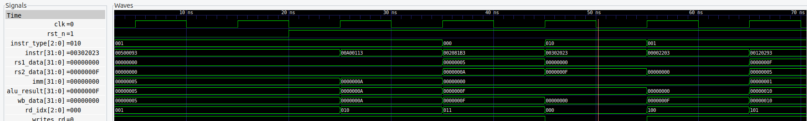

# LEGO RISC-V Educational Core

## 1. Introduction

LEGO RISC-V is an **educational, minimal, and modular RISC-V processor core** designed with a strong academic focus. The goal of this project is not only to implement a working RISC-V core in SystemVerilog, but also to **teach how a processor is built, simulated, and verified**, step by step.

The project emphasizes:

* Architectural clarity over performance
* Clean separation between ISA, microarchitecture, and implementation
* Reproducible, open-source simulation flows
* Progressive scalability toward more advanced cores

This core currently implements a **single-cycle RV32I subset**, intentionally minimal, but architecturally correct.

---

## 2. Educational Philosophy

This project follows three core principles:

1. **Specification first**
   The ISA is clearly documented before RTL is written. RTL must conform to the specification, not define it.

2. **Modules with meaning**
   Each RTL module corresponds to a well-defined architectural concept (PC unit, decoder, regfile, execute, memory).

3. **Observable behavior**
   Simulation, waveforms, and debug traces are first-class citizens. Every instruction can be followed cycle by cycle.

---

## 3. Core Architecture Overview

### 3.1 High-level Architecture

The core is a **single-cycle processor**. Each instruction completes in one clock cycle, making it ideal for teaching.

Conceptually, the processor follows this flow:

```
PC → Instruction Fetch → Decode → Execute → Memory → Writeback → PC update
```

There is no pipelining, no hazards, and no stalls in the current version.

---

### 3.2 Pipeline Diagram (Conceptual)

Although implemented as a single-cycle core, the architecture can be represented as logical stages:

```
+---------+    +---------+    +---------+    +----------+    +-----------+
|   PC    | -> | Decoder | -> | Execute | -> |  Memory  | -> | Writeback |
+---------+    +---------+    +---------+    +----------+    +-----------+
     ^                                                         |
     +--------------------- PC Unit --------------------------+
```

This representation is used **for understanding**, not for timing.

---

## 4. RTL Module Breakdown

### 4.1 `core_top.sv`

Top-level module. Instantiates and connects all submodules. No logic beyond simple wiring and writeback muxing.

### 4.2 `pc_unit.sv`

Responsible for:

* Holding the program counter
* Computing `PC + 4`
* Selecting next PC (sequential, branch, jump)

### 4.3 `decoder.sv`

Purely combinational module that:

* Decodes the instruction
* Extracts fields and immediates
* Generates semantic control signals

### 4.4 `regfile.sv`

* 32 general-purpose registers
* Two read ports, one write port
* x0 is hardwired to zero

### 4.5 `execute.sv`

* Performs ALU operations
* Computes branch conditions
* Generates effective addresses for memory operations

### 4.6 `memory_unit.sv`

* Simple word-addressed data memory
* Combinational load
* Synchronous store

### 4.7 `riscv_defs.sv`

Central definition file containing:

* Opcodes
* ALU operation enums
* Writeback selection
* Instruction type definitions

---

## 5. Supported Instructions (v0)

Currently supported RV32I instructions:

* Arithmetic: `add`, `addi`
* Memory: `lw`, `sw`
* Control: sequential PC (`PC+4`)

Future extensions are planned incrementally.

---

## 6. Project Structure

```
LEGO-RISCV/
│
├── rtl/        # SystemVerilog RTL files
├── tb/         # Simple testbench
├── programs/   # Test programs (.hex)
├── sim/        # Simulation scripts
├── waves/      # Generated waveforms
└── README.md
```

---

## 7. Toolchain (Open Source)

### Required Tools

* **Icarus Verilog** (SystemVerilog simulator)
* **GTKWave** (waveform viewer)

### Installation

#### Ubuntu / WSL

```bash
sudo apt install iverilog gtkwave
```

#### macOS

```bash
brew install icarus-verilog gtkwave
```

---

## 8. Running the Simulation

From the project root:

```bash
./sim/run.sh
```

This will:

1. Compile all RTL and testbench files
2. Run the simulation
3. Generate a VCD waveform
4. Open GTKWave automatically

---

## 9. Understanding the Waveforms

One of the main educational goals of this project is to **visually understand how instructions flow through the processor**. This is achieved by inspecting waveforms generated during simulation.

### 9.1 Recommended Signals

When opening the waveform file in GTKWave, the following signals are especially useful:

* `pc` – current program counter
* `instr` – fetched instruction
* `rs1_data`, `rs2_data` – source register values
* `imm` – decoded immediate value
* `alu_result` – ALU computation result
* `wb_data` – data written back to the register file
* `rd_idx` – destination register index
* `writes_rd` – writeback enable

By observing these signals cycle by cycle, each instruction can be followed end-to-end.

### 9.2 Example: `addi x1, x0, 5`

In a single clock cycle, the waveform will show:

1. `pc` pointing to the instruction address
2. `instr` containing the binary encoding of `addi`
3. `rs1_data = 0` (x0)
4. `imm = 5`
5. `alu_result = 5`
6. `writes_rd = 1`, `rd_idx = 1`
7. `wb_data = 5`

This demonstrates how a full instruction is executed in one cycle.

---

## 10. Example Test Program and Results

### 10.1 Test Program

The following program is used as a basic compliance and integration test:

```asm
addi x1, x0, 5      # x1 = 5
addi x2, x0, 10     # x2 = 10
add  x3, x1, x2     # x3 = 15
sw   x3, 0(x0)      # mem[0] = 15
lw   x4, 0(x0)      # x4 = 15
addi x5, x4, 1      # x5 = 16
```

### 10.2 Expected Results

After execution:

| Register | Value |
| -------- | ----- |
| x1       | 5     |
| x2       | 10    |
| x3       | 15    |
| x4       | 15    |
| x5       | 16    |

Memory:

```
mem[0] = 15
```

These values can be directly verified in the waveform viewer.



---

## 11. Current Status and Next Steps

### Current Status

* Fully functional single-cycle RV32I core
* Open-source simulation flow
* First test program executing correctly

### Planned Extensions

* Branch and jump instructions
* Instruction memory as a standalone module
* Formalized verification
* Pipelined version
* CSR and privileged modes

---

## 12. License and Educational Use

This project is intended for **educational and research purposes**. Feel free to fork, modify, and use it for teaching or learning computer architecture.
